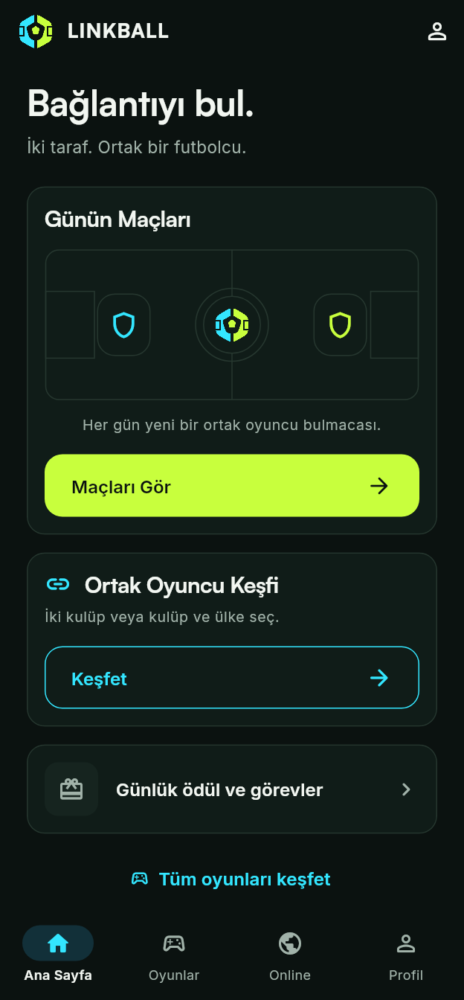
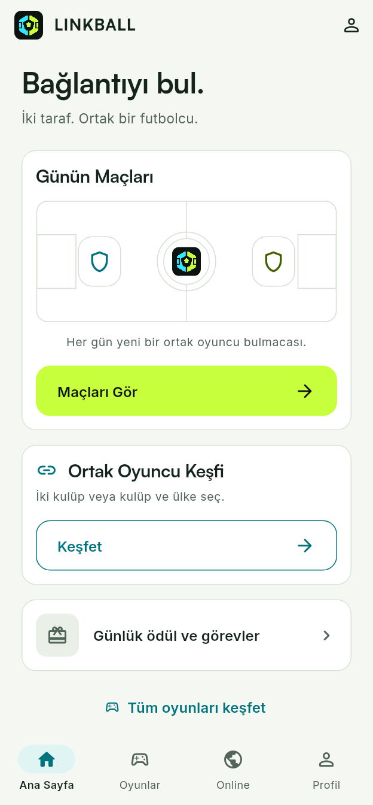
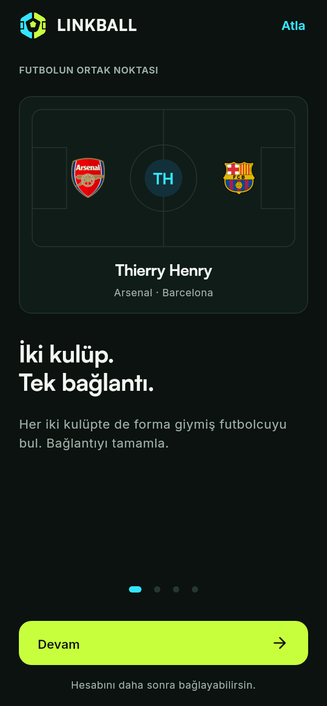
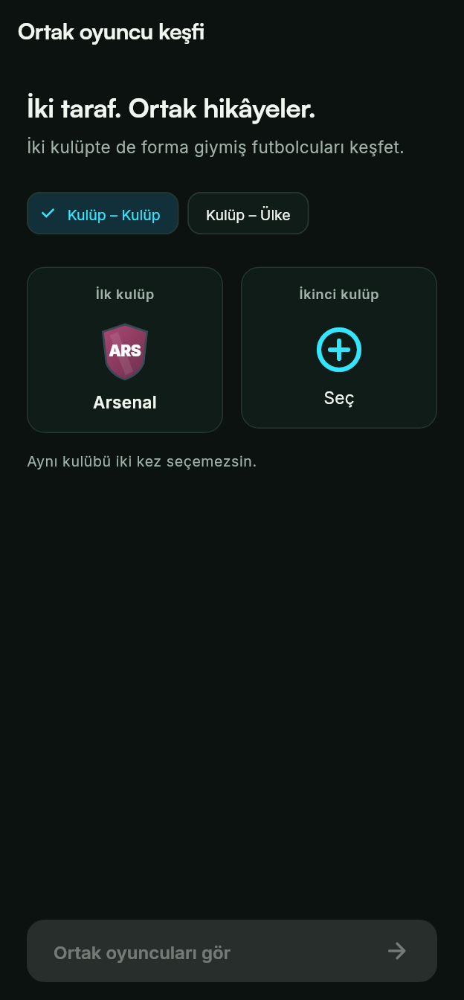

# Ortak Saha V3.1 integration

The approved Cyan Lime / Midnight Pitch direction is now implemented in Flutter's
17B application shell. The approved **01 Ortak Saha** mark is retained.

## Implemented flows

- Four destinations: Ana Sayfa, Oyunlar, Online, Profil. Android back returns
  from another destination to Ana Sayfa. Visited tabs keep their state.
- Daily matches and shared-player discovery are the two primary home actions.
- Four skippable onboarding steps: the common-player idea, daily games,
  club/country discovery, and the wider game catalog. Settings can replay them.
- All 20 existing catalog entries remain available, with category and text search.
  Existing repository/authentication/persistent-account entry requirements remain.
- A shared discovery flow handles club–club and club–country, searchable sheets,
  distinct club selection, popular pairs, player filters and career details.
  Country continues to mean player nationality; it does not imply national-team appearances.
- The daily calendar uses the existing fixture/fallback service. Real fixtures and
  fallback daily connections are labelled separately. Past-date unlocks retain
  their existing point confirmation. Loading errors offer a retry.
- Daily play uses the existing scoring, controller and leaderboard services.
  Rejected or ambiguous input stays editable; a newly accepted answer clears it.
- Profile statistics, nicknames, avatars, friends, missions, store, community,
  safety and privacy/account routes remain reachable.

## Theme and brand

| Role | Dark | Light |
| --- | --- | --- |
| Background | `#0B1210` | `#F5F7F2` |
| Surface | `#101C18` | `#FFFFFF` |
| Raised surface | `#16241F` | `#EAF0E7` |
| Main text | `#F2F6F1` | `#14241C` |
| Secondary text | `#A1B2A9` | `#53655B` |
| Border | `#26372F` | `#D5DFD4` |
| Cyan selection | `#33E6FF` | `#00737D` |
| Main action | `#C8FF3D` with dark text | `#C8FF3D` with dark text |

Satoshi is bundled for headings/wordmark and Inter for interface text. The source
credits and supplied Inter license are in `assets/fonts/`. Core cards use a 16 dp
radius, regular 8/16/24 dp spacing and actions with a minimum 56 dp height.
Buttons respect the system's reduced-animation preference. Layouts scroll and
wrap instead of clamping the user's text scaling.

Android includes legacy PNG icons, adaptive icons (API 26+), monochrome icons
(API 33+), day/night splash vectors, and the supplied wordmark/slogan artwork.
The native launch window ends at Flutter's first frame; there is no extra Dart
splash or artificial minimum duration. Native startup follows the device's theme;
a manually selected in-app theme takes effect when Flutter loads local preferences.
See [Android splash screen guidance](https://developer.android.com/develop/ui/views/launch/splash-screen).

## Settings and scope

Local preferences persist system/light/dark appearance, sound, haptics, onboarding
completion, and notification categories. The sound toggle currently controls the
platform click for accepted daily answers; haptics cover core selections and daily
answer feedback. Notification delivery and OS permission requests are not wired:
the preferences screen states this explicitly. Turkish is the available UI language.

Per-mode interiors remain the subsequent **17C** pass. Many of those existing
screens contain fixed dark surfaces, so `LinkballRoute(modern: false)` explicitly
keeps them in the legacy dark theme, including their nested setup routes/dialogs.
Returning to the shell restores the chosen theme. Core discovery, calendar,
daily play, profile and settings use the new theme. Backend rules, game data,
Firebase Functions and authentication identities are not migrated by this change.

## Verification

Local result: **11 tests passed**; the repository's analyzer command passed with
no errors (pre-existing warnings/info remain). Android resource XML was parsed
successfully; this is not a replacement for Android compilation or device review.

| Dark home | Light home | Onboarding | Discovery |
| --- | --- | --- | --- |
|  |  |  |  |

The widget suite checks onboarding navigation/skip, preference persistence,
catalog entry requirements, search/selection/error recovery, result filters,
wrong-answer retention, route appearance inheritance and phone/landscape layouts
at normal and 200% text size. Visual captures use controlled test data, not live
fixtures or account statistics.

```sh
flutter pub get
flutter analyze --no-fatal-warnings --no-fatal-infos lib test integration_test
flutter test
flutter test --dart-define=UPDATE_SCREENSHOTS=true test/ortak_saha_test.dart
flutter build apk --debug
```

Review captures are written to `.dart_tool/ortak_saha_qa/`. PR CI runs the existing
Flutter/Functions quality gates, including Android debug compilation. CI workflows
are unchanged; downloadable APK publishing is not part of this integration.
The local verification runtime has Flutter 3.47.4 / Dart 3.13.3 and no
Android SDK; Android compilation must be confirmed by CI. The four lockfile
updates are Flutter's pinned test/support dependencies, not new product packages.

Before release, verify native icon masks, light/dark cold starts, system bars and
keyboard behavior on Android 11/12/13+, plus Google sign-in and a live daily game
against the intended Firebase environment. No Play Store release is performed by
this integration branch.
